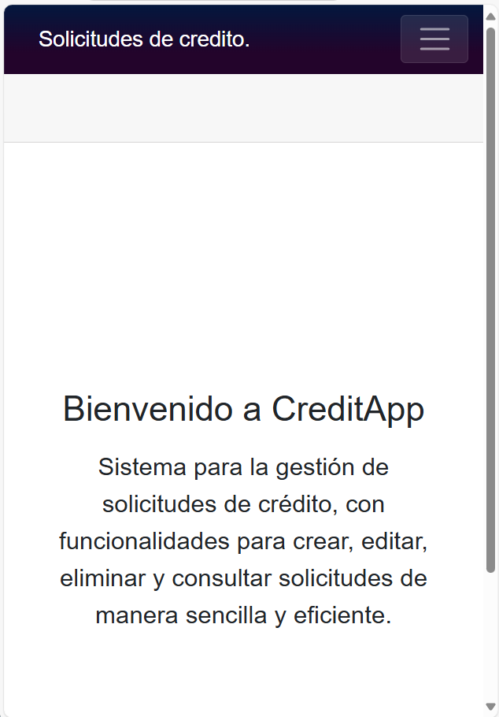
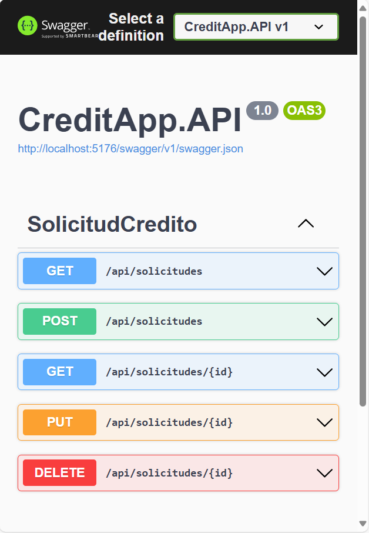
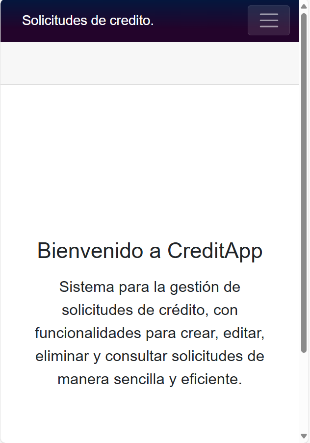
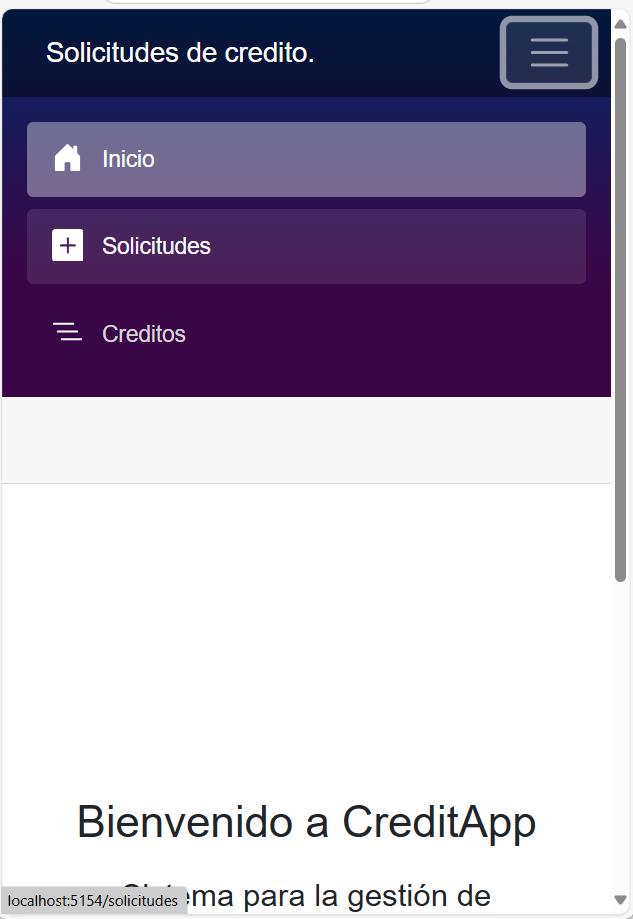
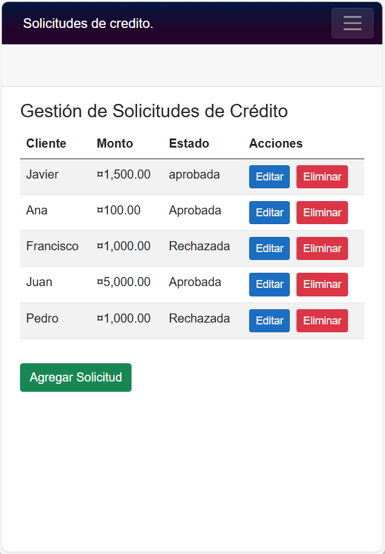
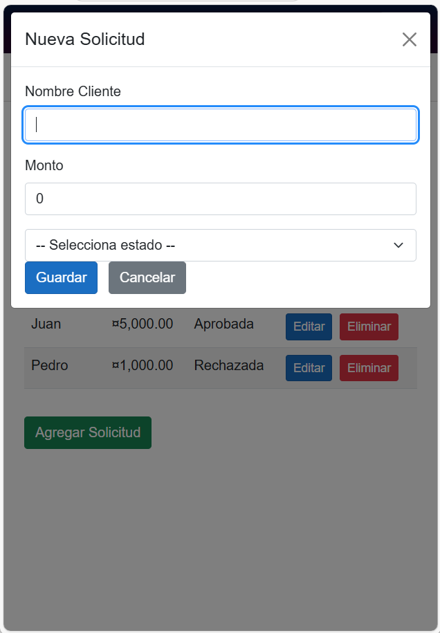
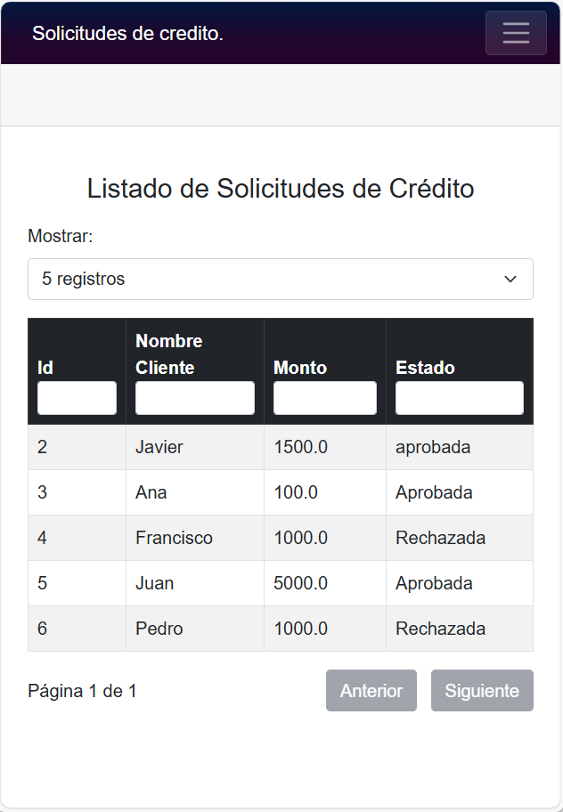
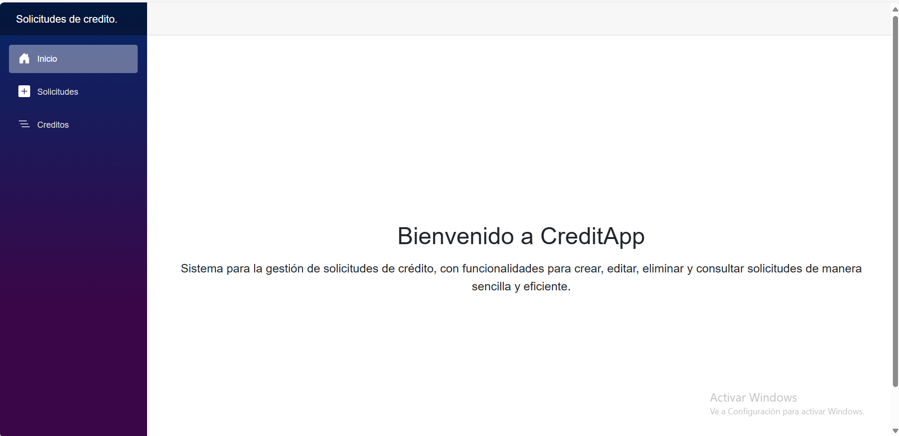
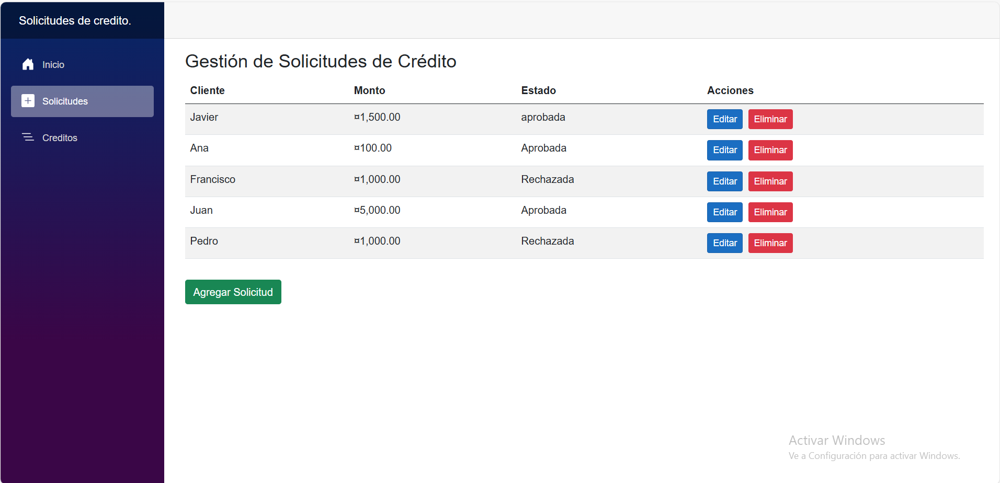
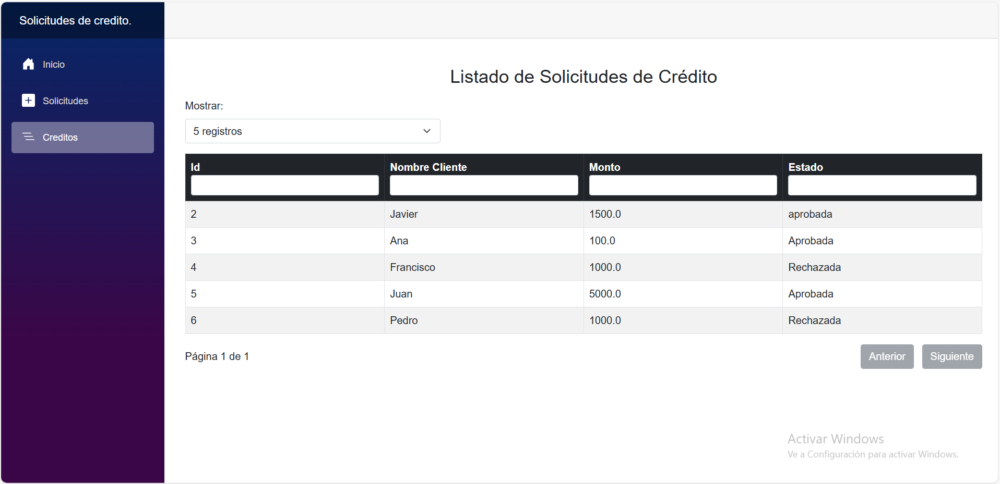

# CreditApp

Sistema de gestión de solicitudes de crédito desarrollado con ASP.NET Core, Blazor WebAssembly y Entity Framework Core.

## ¿Qué hace este sistema?

CreditApp permite gestionar solicitudes de crédito de clientes. Incluye funcionalidades para:

- Listar solicitudes de crédito existentes.
- Crear nuevas solicitudes.
- Editar solicitudes existentes.
- Eliminar solicitudes.
- Visualizar el estado de cada solicitud (Pendiente, Aprobada, Rechazada).

## Estructura del proyecto

- **CreditApp.API**: API RESTful construida con ASP.NET Core.
- **CreditApp.BlazorClient**: Cliente web desarrollado con Blazor WebAssembly.
- **CreditApp.Application, CreditApp.Domain, CreditApp.Infrastructure, CreditApp.Shared**: Capas de aplicación, dominio, infraestructura y recursos compartidos.

## Requisitos

- [.NET 8 SDK](https://dotnet.microsoft.com/download/dotnet/8.0)
- [Visual Studio 2022](https://visualstudio.microsoft.com/) o [Visual Studio Code](https://code.visualstudio.com/)
- SQLite (la base de datos se crea automáticamente)

## Cómo ejecutar el sistema

1. **Clona el repositorio**  
   ```sh
   git clone <url-del-repositorio>
   cd CreditAppSolution
   ```

2. **Restaura los paquetes NuGet**  
   ```sh
   dotnet restore
   ```

3. **Aplica las migraciones y crea la base de datos**  
   Desde la carpeta `CreditApp.API`:
   ```sh
   dotnet ef database update
   ```

4. **Ejecuta la API**  
   Desde la carpeta `CreditApp.API`:
   ```sh
   dotnet run
   ```
   La API estará disponible en `http://localhost:5176` (puerto configurable).

5. **Ejecuta el cliente Blazor**  
   Desde la carpeta `CreditApp.BlazorClient`:
   ```sh
   dotnet run
   ```
   El cliente estará disponible en `http://localhost:5154`.

## Notas de implementación

- El cliente Blazor consume la API REST para todas las operaciones.
- La comunicación entre cliente y servidor se realiza en formato JSON.
- El sistema utiliza SQLite como base de datos por defecto.
- Swagger está habilitado en desarrollo para probar la API.

## Licencia

 
MIT


## Vista del sistema 🖼️

A continuación se muestra una captura de la interfaz del sistema desde el navegador:













 
